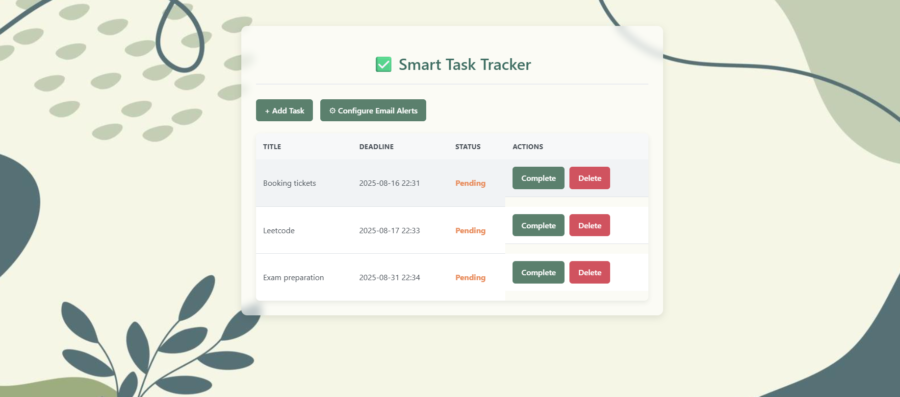
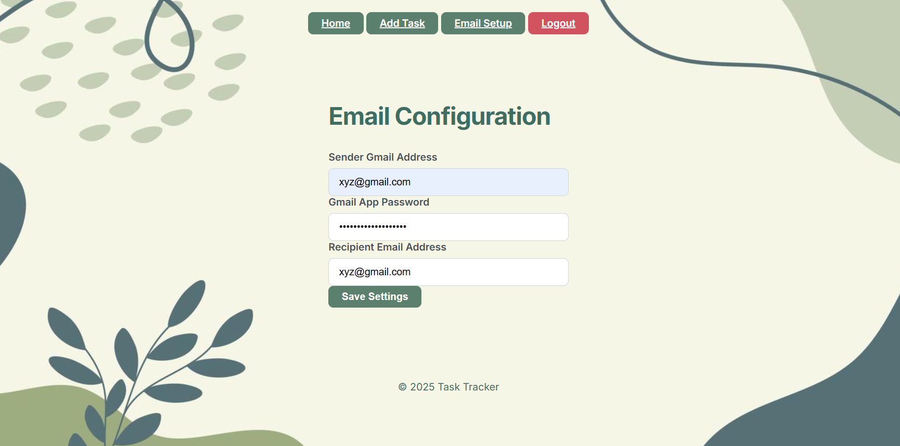
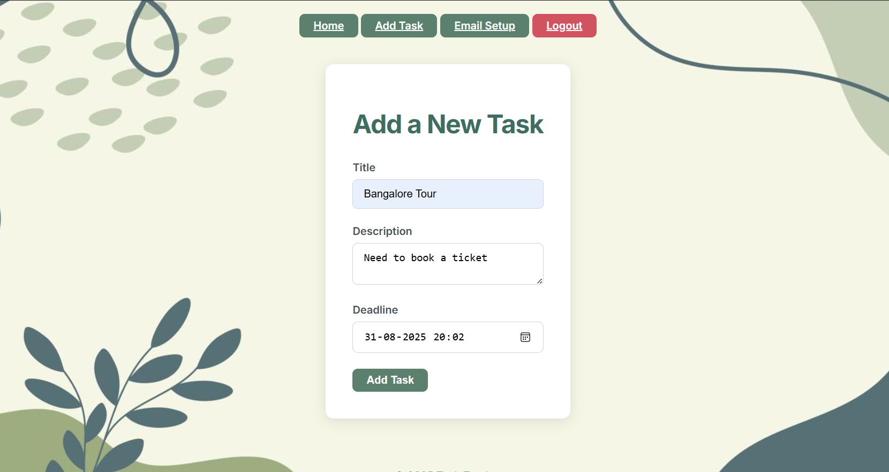

# 📝 Smart Task Tracker

A lightweight and intuitive web application to manage your tasks, deadlines, and reminders effectively.  
With its clean interface and automated email reminder system, **Smart Task Tracker** ensures you never miss an important deadline.

---

## 💡 Project Highlights

- **End-to-End Development** – Built complete task tracking system with Flask backend and SQLite database.
- **Automated Email Alerts** – Integrated Gmail API (via Flask-Mail) to send reminders 24 hours before deadlines.
- **Persistent Storage** – Used Flask-SQLAlchemy ORM for seamless database interaction.
- **Responsive & Minimal UI** – Designed a clean HTML/CSS interface for quick task management.
- **Background Scheduler** – Implemented a threaded reminder system to run alongside the main app.
- **Configurable Alerts** – Added UI for setting sender, recipient, and secure Gmail App Password.
- **Portfolio-Ready** – Packaged with clear documentation and MIT License for public use.

---

## 🚀 Features

- **Task Management** – Add new tasks with titles and deadlines.
- **Status Tracking** – Mark tasks as `Pending` or `Completed`.
- **Task Deletion** – Remove tasks you no longer need.
- **Email Reminders** – Receive alerts 24 hours before a task's deadline.
- **User-Friendly UI** – Minimalistic, modern, and responsive design.

---

## 🛠️ Tech Stack

### Backend
- [Flask](https://flask.palletsprojects.com/) – Micro web framework for Python
- [Flask-SQLAlchemy](https://flask-sqlalchemy.palletsprojects.com/) – ORM for database operations
- [Flask-Mail](https://pythonhosted.org/Flask-Mail/) – Email sending functionality

### Frontend
- HTML
- CSS

### Database
- SQLite

---

## 📦 Getting Started

### Prerequisites
- Python 3.x installed  
- Install dependencies:

```bash
pip install -r requirements.txt
```
# 📝 Smart Task Tracker

A lightweight and intuitive web application to manage your tasks, deadlines, and reminders effectively.  
With its clean interface and automated email reminder system, **Smart Task Tracker** ensures you never miss an important deadline.

---

## 📦 Installation

### 1️⃣ Clone the repository
```bash
git clone https://github.com/rev0995/Smart_task_tracker.git
cd Smart_task_tracker
```
# 📝 Smart Task Tracker

A lightweight and intuitive web application to manage tasks, deadlines, and reminders efficiently.  
With a clean interface and automated email alert system, it ensures you never miss an important deadline.

---

## 📦 Installation

### 2️⃣ Create the database
The first run will automatically create a `tasks.db` file.

### 3️⃣ Run the application
```bash
python app.py
```
### 4️⃣ Open in Browser
```text
http://127.0.0.1:5000
```
## 📧 Email Configuration

To enable **email reminders**:

1. On the home page, click **⚙ Configure Email Alerts**.
2. Enter:
   - **Sender Gmail Address** – Email from which reminders will be sent.
   - **Gmail App Password** – [Generate a Gmail App Password](https://support.google.com/accounts/answer/185833) (regular password will not work).
   - **Recipient Email Address** – Email to receive reminders.
3. Click **Save Email Settings**.  
   A background thread will monitor deadlines and send reminders **24 hours before** a task is due.

---

## 📷 Screenshots
### Home Page


### Email Configuration

### Task Configuration


---

## 👩‍💻 Author
**Revathi Ch**  
[GitHub](https://github.com/rev0995)
